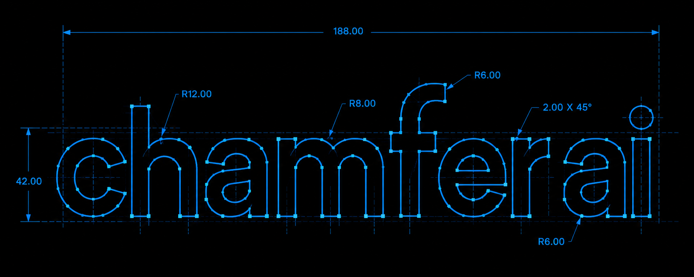
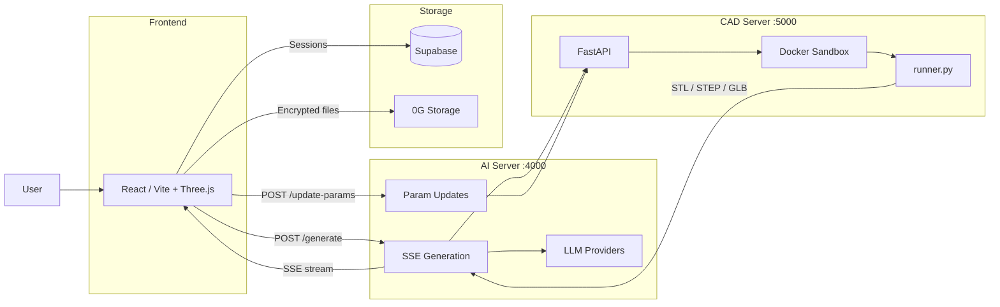
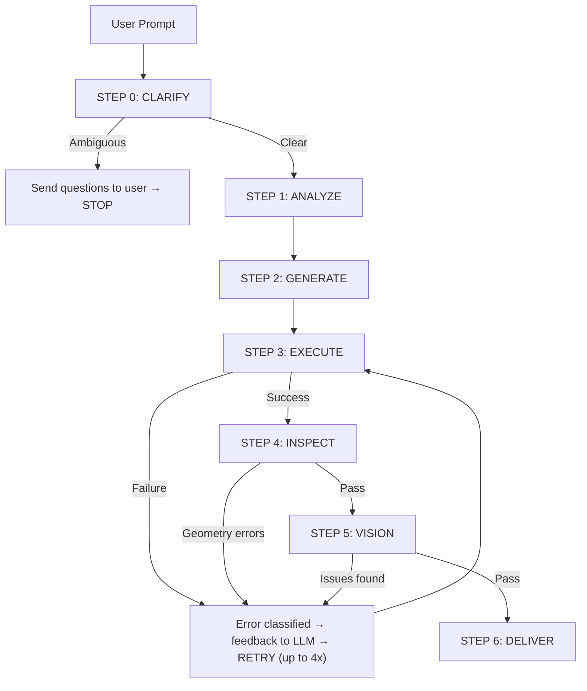
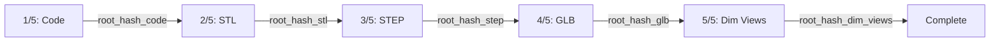
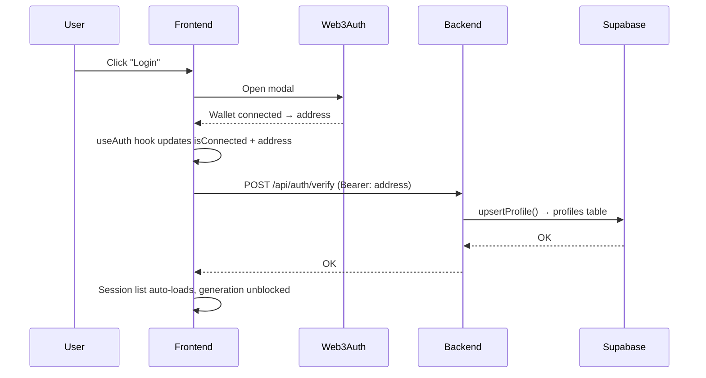
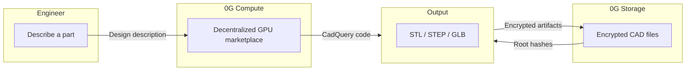

<p align="center">
  
</p>

<p align="center">
  AI-powered parametric CAD generation platform built on <a href="https://0g.ai">0G</a> — the blockchain for AI agents. Users describe a part in natural language, and LLM agents generate, execute, inspect, and iteratively repair CadQuery Python code to produce manufacturable STL/STEP/GLB files. AI inference runs on <a href="https://docs.0g.ai/concepts/compute">0G Compute</a> (decentralized, no centralized logging, 90% cheaper than AWS), and encrypted CAD assets are stored on <a href="https://docs.0g.ai/concepts/storage">0G Storage</a> (95% lower cost than S3, instant retrieval, immutable audit trail).
</p>

---

## Why 0G?

Engineering companies generate sensitive, high-value CAD assets — proprietary part designs, toolpaths, and manufacturing-ready models. Storing these on centralized infrastructure creates real business risks:

**The problem with centralized AI (OpenAI, Anthropic, Google):**
- Your prompts and generated code pass through their servers — they can log, train on, or leak your designs
- Vendor lock-in: pricing changes, API deprecations, or policy shifts can break your pipeline overnight
- No audit trail — you can't prove what happened to your data after sending it
- Fixed monthly costs regardless of usage — expensive for startups and teams

**The problem with centralized storage (AWS S3, Google Cloud, Azure):**
- Single points of failure — an outage locks you out of your own files
- The provider can read, censor, or delete your assets at any time
- Compliance headaches: storing IP in jurisdictions you don't control
- Vendor lock-in with opaque pricing that increases over time

**0G is purpose-built to solve both.**

[0G](https://0g.ai) (ZeroGravity) is the blockchain for AI agents — a modular L1 that combines decentralized compute, storage, and data availability into one stack. Mainnet live since September 2025, 28M+ blocks produced, 346K+ accounts, 300+ ecosystem partners including Chainlink, Google Cloud, and Alibaba Cloud.

| Problem | 0G Solution | vs. Centralized |
|---------|-------------|-----------------|
| AI inference logging | **0G Compute** — decentralized GPU marketplace | No data retention by providers. Verifiable computation proofs (TEEML, OPML, ZKML). 90% cheaper than AWS/Google. |
| File storage trust | **0G Storage** — content-addressed, erasure-coded | 95% lower costs than AWS. Instant retrieval. Survives 30% node failure. |
| Auditability | Every upload is an on-chain transaction | Immutable proof of what was stored and when |
| Availability | Distributed across thousands of nodes | No single point of failure. 11K+ TPS per shard. |
| Vendor lock-in | Open protocol, pay-per-use | Works with any blockchain or Web2 app. No subscriptions. |

> **Without 0G, this is just another AI wrapper that sends your IP to OpenAI. With 0G, it's a sovereign CAD platform where companies own their data end-to-end.**

---

## Table of Contents

- [Why 0G?](#why-0g)
- [Architecture Overview](#architecture-overview)
- [Project Structure](#project-structure)
- [Frontend](#frontend)
- [AI Server (Orchestration)](#ai-server-orchestration)
- [CAD Server (Sandboxed Execution)](#cad-server-sandboxed-execution)
- [Agent Workflow](#agent-workflow)
- [Chat Session Management](#chat-session-management)
- [0G Decentralized Storage](#0g-decentralized-storage)
- [Authentication](#authentication)
- [Database Schema](#database-schema)
- [Environment Variables](#environment-variables)
- [Getting Started](#getting-started)

---

## Architecture Overview



---

## Project Structure

```
chamferai/
├── frontend/                 # React + Vite + Three.js frontend
│   ├── src/
│   │   ├── App.tsx           # Main app — chat, generation, session management
│   │   ├── components/
│   │   │   ├── chat/         # Chat UI (messages, workflow, dim views, root hashes)
│   │   │   ├── cad/          # CAD UI (3D viewport, params, inspection, export)
│   │   │   ├── layout/       # Layout panels (sidebar, preview, provider selector)
│   │   │   ├── auth/         # Web3Auth login/logout
│   │   │   └── ui/           # Reusable UI primitives (shadcn-style)
│   │   ├── hooks/            # useAuth (Web3Auth), useParamUpdate, useAutoScroll
│   │   ├── lib/              # Constants, API endpoints, utils
│   │   ├── config/           # Web3Auth config
│   │   └── types/            # TypeScript types (Message, Parameter, etc.)
│   └── package.json
│
├── backend/
│   ├── ai-server/            # Express/TypeScript orchestration server
│   │   ├── src/
│   │   │   ├── index.ts              # Express app + route registration
│   │   │   ├── config.ts             # LLM provider configs (10 providers)
│   │   │   ├── middleware/auth.ts    # Wallet-address auth middleware
│   │   │   ├── routes/
│   │   │   │   ├── generate.ts       # SSE generation pipeline + param updates
│   │   │   │   ├── chat.routes.ts    # Chat session save/list/history
│   │   │   │   ├── auth.routes.ts    # Profile upsert on wallet connect
│   │   │   │   └── models.routes.ts  # 0G upload/download + saved models CRUD
│   │   │   └── services/
│   │   │       ├── llm.ts            # LLM code generation, clarification, vision
│   │   │       ├── prompt.ts         # System prompt for CadQuery generation
│   │   │       ├── clarifier-prompt.ts # System prompt for clarification agent
│   │   │       ├── db.ts             # Supabase queries (profiles, sessions, models)
│   │   │       └── zgStorage.ts      # 0G Storage SDK (encrypted upload/download)
│   │   └── package.json
│   │
│   └── cad-server/           # FastAPI/Python CAD execution server
│       ├── src/
│       │   ├── main.py               # FastAPI app (/execute, /update-params)
│       │   ├── executor.py           # Docker SDK sandbox launcher
│       │   ├── runner.py             # In-container restricted Python executor
│       │   ├── inspector.py          # B-rep geometry inspection
│       │   ├── snapshot.py           # SVG snapshot renderer
│       │   ├── png_snapshot.py       # PNG render (for LLM vision inspection)
│       │   ├── dim_views.py          # 2D orthographic dimensional views
│       │   └── params.py             # Parameter substitution
│       ├── Dockerfile                # Sandboxed CadQuery executor image
│       ├── requirements.txt
│       └── build.sh
│
└── docs/
    ├── supabase_schema.sql           # Full DB schema
    └── supabase_migration_v*.sql     # Incremental migrations
```

---

## Frontend

**Stack:** React 19, Vite 8, TypeScript, Three.js (via @react-three/fiber + drei), Tailwind CSS, Framer Motion, Web3Auth + Wagmi, react-resizable-panels.

### Key UI Components

| Component | Purpose |
|-----------|---------|
| `App.tsx` | Main orchestrator — chat state, generation flow, session save/load, 0G upload triggers, parameter updates |
| `ChatInput` | Prompt input with provider selector + reasoning toggle |
| `StreamingMessage` | Live workflow timeline during SSE generation |
| `WorkflowTimeline` | Hardcoded skeleton of the agent pipeline steps (shown on reload) |
| `ClarificationMessage` | Interactive Q&A when the prompt is ambiguous |
| `ClarificationAnswers` | Displays saved specification Q&A on session reload |
| `DimViews` | Orthographic top/front/side views with dimension annotations + lightbox |
| `RootHashes` | 0G storage root hash display (Code/STL/STEP/GLB/Dim Views) with copy buttons |
| `STLModel` | Three.js STL viewer with adaptive grid + viewport HUD |
| `ParameterPanel` | Slider controls for parametric model adjustments |
| `InspectionPanel` | Geometry stats (faces, edges, volume, bounding box, warnings) |
| `ExportSection` | Download STL/STEP/GLB files |
| `Sidebar` | Session history list + wallet display + new task button |
| `LoginButton` | Web3Auth connect/disconnect |

### Key Hooks

- **`useAuth`** — Web3Auth wallet connection, provides `isConnected`, `address`, `getAuthHeader()`
- **`useParamUpdate`** — Debounced parameter slider changes → calls `/api/update-params` → updates STL/STEP/GLB/dimViews/inspection in place
- **`useAutoScroll`** — Auto-scrolls chat to bottom on new messages

### Auth Flow

- No login wall — the app loads normally with `Login / Sign Up` visible at top-right
- CAD generation is **blocked** unless authenticated
- Web3Auth connects a wallet, and the wallet address is used as the Bearer token for all API calls
- On connect, `POST /api/auth/verify` upserts the wallet address into the `profiles` table

---

## AI Server (Orchestration)

**Stack:** Express 4, TypeScript, OpenAI SDK (compatible with multiple providers), Supabase JS SDK, 0G Storage TS SDK, ethers.js v6.

### LLM Providers

The server supports 10 providers via an OpenAI-compatible interface. For privacy-sensitive CAD work, **0G Compute** is the recommended provider:

| Provider ID | Model | Vision | Notes |
|-------------|-------|--------|-------|
| `0g` | Qwen 2.5 Omni 7B | Yes | **0G Compute** — decentralized GPU marketplace. No data retention. Verifiable proofs. 90% cheaper than centralized providers. |
| `mimo` | MiMo 2.5 | Yes | Xiaomi MiMo, 310B (15B active) |
| `mimo-pro` | MiMo 2.5 Pro | No | 1T (42B active) |
| `deepseek-v4-flash` | DeepSeek V4 Flash | No | Fast, 1M context |
| `deepseek-v4-pro` | DeepSeek V4 Pro | No | Pro reasoning, 1M context |
| `qwen3p7-plus` | Qwen 3.7 Plus | Yes | 262K context |
| `kimi-k2p6` | Kimi K2.6 | Yes | 262K context |
| `minimax-m3` | MiniMax M3 | Yes | 512K context |
| `glm-5p1` | GLM 5.1 | No | 202K context |
| `glm-5p2` | GLM 5.2 | No | Opus-level, 1M context |

> **Why 0G Compute matters for CAD:** When an engineer describes a proprietary part design, that prompt contains trade secrets — dimensions, materials, tolerances. Centralized AI providers can log, analyze, and potentially leak those prompts. 0G Compute runs inference on a decentralized GPU marketplace with cryptographic verification — your design descriptions never touch a centralized server, and you pay only for actual compute used.

### API Endpoints

| Method | Path | Auth | Purpose |
|--------|------|------|---------|
| `POST` | `/api/generate` | No* | SSE generation pipeline (clarify → generate → execute → inspect → vision → deliver) |
| `POST` | `/api/update-params` | No* | Re-execute code with new parameter values |
| `GET` | `/api/providers` | No | List available LLM providers |
| `GET` | `/api/health` | No | Health check |
| `POST` | `/api/auth/verify` | Yes | Upsert profile on wallet connect |
| `POST` | `/api/chat/save` | Yes | Save chat session + messages |
| `GET` | `/api/chat/sessions` | Yes | List user's chat sessions |
| `GET` | `/api/chat/history/:sessionId` | Yes | Load session + messages |
| `POST` | `/api/models/upload-to-0g` | Yes | Upload CAD assets to 0G, save root hashes to Supabase |
| `GET` | `/api/models/session/:sessionId/latest` | Yes | Fetch latest model from 0G for a session |
| `GET` | `/api/models/fetch-from-0g/:rootHash` | Yes | Fetch individual file by root hash |
| `POST` | `/api/models/save` | Yes | Save model metadata directly |
| `GET` | `/api/models` | Yes | List all saved models |
| `GET` | `/api/models/:id` | Yes | Get single saved model |
| `DELETE` | `/api/models/:id` | Yes | Delete saved model |

*Generation is blocked on the frontend if not authenticated; the backend endpoint itself does not require auth.

---

## CAD Server (Sandboxed Execution)

**Stack:** FastAPI, Python 3.12, CadQuery, Docker SDK, matplotlib, numpy.

### Docker Sandbox

All LLM-generated Python code is executed inside a **locked-down Docker container** — never directly on the host.

| Security Measure | Value |
|-----------------|-------|
| Network | `none` (air-gapped, no internet) |
| Memory limit | `2g` |
| CPU | 1 core |
| Timeout | 30 seconds |
| User | `1000:1000` (non-root) |
| Filesystem | Read-only root, tmpfs `/tmp` (128MB) |
| Capabilities | All dropped (`cap_drop: ALL`) |
| Privileges | `no-new-privileges` |
| Cleanup | Container killed + removed after execution |

### Execution Pipeline (inside container)

1. `runner.py` reads `config.json` and `user_code.py` from the mounted `/work` volume
2. User code is `exec()`'d inside a **restricted namespace** — only `cadquery` and `math` imports are allowed; `os.system`, `open()`, `subprocess`, and all other modules are blocked
3. The resulting CadQuery shape is exported as STL, STEP, and GLB
4. **Validation** — volume, surface area, bounding box, zero-volume check, unit sanity
5. **Inspection** — face count, edge count, vertex count, shape type, B-rep validity, solid check, center of mass, warnings/errors
6. **SVG snapshots** — multi-view orthographic renders (iso, front, top, side)
7. **PNG snapshots** — photorealistic renders for LLM vision inspection
8. **Dimensional views** — 2D top/front/side outlines with dimension annotations

All outputs are written as JSON/base64 files to `/work/` and collected by `executor.py` on the host.

---

## Agent Workflow

The generation pipeline is a multi-agent, multi-retry system orchestrated via Server-Sent Events (SSE). The frontend receives real-time workflow step updates that render as a live timeline in the chat.



### Retry Logic

- **Max retries:** 4 attempts
- On each failure, the error is classified (syntax, import, CadQuery API, geometry, vision) and a repair hint is generated
- The LLM receives the error + hint and is asked to make the **smallest possible fix**
- After all retries exhausted, a **best-effort** result is returned if any code produced valid output

### Parameter Updates (post-generation)

After a model is generated, users can adjust parameters via sliders in the inspect panel:

1. Slider change → 300ms debounce
2. `POST /api/update-params` with current code + new param values
3. CAD server re-executes in Docker sandbox
4. New STL/STEP/GLB/snapshots/dimViews/inspection returned
5. 3D preview updates in real-time
6. "Store this iteration" button appears — user clicks to upload the new version to 0G

---

## Chat Session Management

### Overview

Chat sessions are persisted in Supabase using a two-table approach. Only **user-visible data** is stored — model reasoning is never persisted.

### Database Tables

**`chat_sessions`** — Session metadata
| Column | Type | Description |
|--------|------|-------------|
| `id` | UUID (PK) | Session ID |
| `user_wallet` | TEXT (FK) | Wallet address |
| `title` | TEXT | First 60 chars of first user prompt |
| `parameters` | JSONB | Model parameters |
| `created_at` | TIMESTAMPTZ | Creation timestamp |
| `updated_at` | TIMESTAMPTZ | Last update timestamp |

**`chat_messages`** — Individual messages (one row per turn)
| Column | Type | Description |
|--------|------|-------------|
| `id` | UUID (PK) | Message ID |
| `session_id` | UUID (FK) | Session reference |
| `message_order` | INT | Order within session |
| `role` | TEXT | `user` or `assistant` |
| `content` | TEXT | Message text |
| `specifications` | JSONB | Clarification Q&A pairs |
| `provider` | TEXT | LLM provider used |
| `created_at` | TIMESTAMPTZ | Creation timestamp |

### What is NOT stored in chat messages

- **Model reasoning** — never persisted; only streamed live via SSE
- **Dim views** — moved to 0G storage (stored as encrypted JSON, root hash in `saved_models`)
- **CAD code / STL / STEP / GLB** — stored in 0G, root hashes in `saved_models`
- **Workflow steps** — hardcoded as a skeleton in `WorkflowTimeline.tsx`, re-rendered on reload

### Session Save Flow

1. After generation completes, the frontend calls `POST /api/chat/save` with messages (role, content, specifications, provider) and parameters
2. Backend collapses messages: user prompt + specifications + assistant result → compact rows
3. Messages are inserted with incremental `message_order`
4. The response includes `sessionId` and `latestMessageOrder` — used for the subsequent 0G upload

### Session Load Flow

1. On wallet connect, `GET /api/chat/sessions` fetches the session list (sorted by `updated_at DESC`)
2. The most recent session auto-loads once
3. `GET /api/chat/history/:sessionId` fetches messages
4. `GET /api/models/session/:sessionId/latest` fetches CAD assets from 0G (code, STL, STEP, GLB, dim views)
5. Frontend restores: chat messages, 3D preview, inspection panel, dim views, parameters, root hashes

---

## 0G Decentralized Storage

ChamferAI uses [0G Storage](https://docs.0g.ai/concepts/storage) as the primary file storage layer for all CAD assets. This is not an optional add-on — it's core to the value proposition.

### Why Not Just Use S3?

| Concern | Centralized (S3/GCS) | 0G Storage |
|---------|---------------------|------------|
| **Cost** | Expensive, pricing increases over time | **95% lower costs** than AWS |
| **Data ownership** | Provider can access your files | Encrypted, only you hold root hashes |
| **Single point of failure** | AWS outage = your data is gone | Distributed across thousands of nodes. Survives 30% node failure via erasure coding. |
| **Audit trail** | Opaque access logs | Every upload is an on-chain transaction |
| **Vendor lock-in** | Hard to migrate, proprietary APIs | Content-addressed, portable. Works with any blockchain or Web2 app. |
| **Compliance** | Data in jurisdictions you don't control | You choose where your nodes run |
| **Retrieval speed** | Fast (CDN-backed) | **Instant** — 200 MBPS even at network congestion |

0G Storage uses a two-lane architecture: a **Data Publishing Lane** for metadata and availability proofs, and a **Data Storage Lane** with erasure coding that splits data into chunks with redundancy. Even if 30% of nodes fail, your data remains accessible.

Storage providers earn through **Proof of Random Access (PoRA)** — a consensus mechanism where miners must cryptographically prove they actually store the data they claim to store, with random challenges and quick response requirements. Mining is capped at 8 TB per operation to keep it fair and prevent centralization.

### What Gets Stored

| Asset | Format | 0G Upload Type |
|-------|--------|----------------|
| CadQuery code | UTF-8 text | `uploadTo0G(code, false)` |
| STL | Base64 binary | `uploadTo0G(stlBase64, true)` |
| STEP | Base64 binary | `uploadTo0G(stepBase64, true)` |
| GLB | Base64 binary | `uploadTo0G(glbBase64, true)` |
| Dim views | JSON-serialized `{ top: "base64...", front: "...", side: "..." }` | `uploadTo0G(jsonStr, false)` |

### Encryption — Why It Matters

Engineering CAD files are **trade secrets**. A gear design, a bracket, a housing — these represent thousands of hours of R&D. If leaked, competitors can manufacture your parts without investing in design.

All uploads are encrypted with **AES-256** using a single server-wide master key (`FILE_MASTER_KEY` env var). The key is SHA-256 hashed to produce a 32-byte AES key. The same key is used for decryption on download.

Even if someone gains access to the 0G network, they see only encrypted blobs — not your designs. Only your application, with the master key, can decrypt and render the files.

### Upload Sequence

Uploads happen **sequentially** (not in parallel) to avoid nonce collisions on the 0G chain — each upload is an on-chain transaction from the same wallet, so parallel submissions would conflict.



Each step logs `[0G] Upload N/5 (type) initiated...` and `[0G] Upload N/5 (type) successful: 0x...` to the backend console.

### Root Hash Storage

Root hashes are saved to the `saved_models` table in Supabase:

| Column | Type | Description |
|--------|------|-------------|
| `id` | UUID (PK) | Model ID |
| `user_wallet` | TEXT (FK) | Wallet address |
| `chat_session_id` | UUID (FK) | Session reference |
| `message_order` | INT | Which iteration |
| `name` | TEXT | e.g. "Iteration 1" |
| `root_hash_code` | TEXT | 0G root hash for code |
| `root_hash_stl` | TEXT | 0G root hash for STL |
| `root_hash_step` | TEXT | 0G root hash for STEP |
| `root_hash_glb` | TEXT | 0G root hash for GLB |
| `root_hash_dim_views` | TEXT | 0G root hash for dim views |
| `parameters` | JSONB | Model parameters |
| `inspection` | JSONB | Inspection data |
| `bounding_box` | JSONB | Bounding box |
| `upload_status` | TEXT | `pending` / `complete` / `failed` |
| `upload_error` | TEXT | Error message if failed |
| `created_at` | TIMESTAMPTZ | Creation timestamp |
| `updated_at` | TIMESTAMPTZ | Last update timestamp |

Unique constraint on `(chat_session_id, message_order)` — one model per message.

### Upload Triggers

1. **Auto-upload after generation** — when a new model is generated via chat prompt, the frontend automatically triggers a 0G upload after the chat session is saved
2. **Manual "Store this iteration"** — after adjusting parameters via sliders, a button appears in the inspect panel; user clicks to upload the modified model

### Download / Restore

On session load, `GET /api/models/session/:sessionId/latest`:
1. Fetches the latest `complete` model row from Supabase
2. Downloads all 5 assets from 0G in parallel (using root hashes)
3. Dim views JSON is parsed back to `Record<string, string>`
4. Everything is returned to the frontend and restored into the UI

### Root Hash Display

Root hashes are shown in the chat below the dimensional views, with:
- Loading spinner ("Root hashes loading...") while the upload is in progress
- After completion: 5 rows (Code/STL/STEP/GLB/Dim Views) with truncated hashes and copy-to-clipboard buttons

---

## Authentication

### Web3Auth + Wallet-Based Auth

- **Web3Auth** provides wallet connection (MetaMask, social logins, etc.)
- The connected **wallet address** is the sole identity — no passwords, no JWTs
- All authenticated API calls send `Authorization: Bearer <wallet_address>`
- Backend middleware (`auth.ts`) validates the address format (`0x` + 40 hex chars) and attaches it to the request
- Supabase Row Level Security is enabled but access is controlled via the service role key on the backend (per-wallet filtering in queries)

### Auth Flow



---

## Database Schema

### Full Schema (Supabase / PostgreSQL)

```sql
-- Profiles
CREATE TABLE profiles (
  id UUID DEFAULT gen_random_uuid() PRIMARY KEY,
  wallet_address TEXT UNIQUE NOT NULL,
  display_name TEXT,
  created_at TIMESTAMPTZ DEFAULT NOW()
);

-- Chat Sessions
CREATE TABLE chat_sessions (
  id UUID DEFAULT gen_random_uuid() PRIMARY KEY,
  user_wallet TEXT NOT NULL REFERENCES profiles(wallet_address),
  title TEXT,
  parameters JSONB,
  created_at TIMESTAMPTZ DEFAULT NOW(),
  updated_at TIMESTAMPTZ DEFAULT NOW()
);

-- Chat Messages
CREATE TABLE chat_messages (
  id UUID DEFAULT gen_random_uuid() PRIMARY KEY,
  session_id UUID NOT NULL REFERENCES chat_sessions(id) ON DELETE CASCADE,
  message_order INT NOT NULL,
  role TEXT NOT NULL CHECK (role IN ('user', 'assistant')),
  content TEXT,
  specifications JSONB,
  provider TEXT,
  created_at TIMESTAMPTZ DEFAULT NOW()
);

-- Saved Models (0G root hashes)
CREATE TABLE saved_models (
  id UUID DEFAULT gen_random_uuid() PRIMARY KEY,
  user_wallet TEXT NOT NULL REFERENCES profiles(wallet_address),
  chat_session_id UUID NOT NULL REFERENCES chat_sessions(id) ON DELETE CASCADE,
  message_order INT NOT NULL,
  name TEXT NOT NULL,
  root_hash_code TEXT,
  root_hash_stl TEXT,
  root_hash_step TEXT,
  root_hash_glb TEXT,
  root_hash_dim_views TEXT,
  parameters JSONB,
  inspection JSONB,
  bounding_box JSONB,
  upload_status TEXT NOT NULL DEFAULT 'pending'
    CHECK (upload_status IN ('pending', 'complete', 'failed')),
  upload_error TEXT,
  created_at TIMESTAMPTZ DEFAULT NOW(),
  updated_at TIMESTAMPTZ DEFAULT NOW(),
  UNIQUE(chat_session_id, message_order)
);

-- RLS enabled on all tables
-- Indexes on wallet, session, message_order, etc.
```

Migrations are in `docs/supabase_schema.sql` and `docs/supabase_migration_v*.sql`.

---

## Environment Variables

### Frontend (`frontend/.env`)

```env
VITE_API_URL=http://localhost:4000
VITE_WEB3AUTH_CLIENT_ID=your_web3auth_client_id
VITE_WEB3AUTH_CHAIN_CONFIG=...
```

### AI Server (`backend/ai-server/.env`)

```env
# Server
PORT=4000
CAD_SERVER_URL=http://localhost:5000

# Supabase
SUPABASE_URL=https://your-project.supabase.co
SUPABASE_SERVICE_KEY=your_service_role_key

# LLM Providers
FIREWORKS_API_KEY=your_fireworks_key
MIMO_API_KEY=your_mimo_key
OG_API_KEY=your_0g_router_key
OG_BASE_URL=https://router-api-testnet.integratenetwork.work/v1
OG_MODEL=qwen/qwen2.5-omni-7b

# 0G Storage
OG_PRIVATE_KEY=your_0g_wallet_private_key
OG_RPC_URL=https://evmrpc-testnet.0g.ai
OG_INDEXER_RPC=https://indexer-storage-testnet-turbo.0g.ai
FILE_MASTER_KEY=your_file_encryption_master_key
```

### CAD Server

No environment variables required. The CAD server reads from `config.cadServerUrl` on the AI server.

---

## Getting Started

### Prerequisites

- Node.js 20+
- Python 3.12+
- Docker Desktop (running)
- Supabase project (with schema applied)

### 1. Database Setup

Run `docs/supabase_schema.sql` in the Supabase SQL Editor, followed by any migration files (`supabase_migration_v*.sql`) in order.

### 2. CAD Server (Docker Image + API)

```bash
cd backend/cad-server

# Build the sandboxed executor image
docker build -t chamferai-cad-executor .

# Start the CAD API server
pip install -r requirements.txt
python -m uvicorn src.main:app --reload --port 5000
```

### 3. AI Server

```bash
cd backend/ai-server
npm install

# Create .env (see Environment Variables above)
npm run dev
```

### 4. Frontend

```bash
cd frontend
npm install

# Create .env (see Environment Variables above)
npm run dev
```

### 5. Verify

- Open `http://localhost:5173` (or the Vite-provided URL)
- Click **Login** to connect a wallet
- Enter a prompt (e.g., "make a gear with 12 teeth")
- Watch the agent workflow execute in real-time
- 3D model appears in the preview panel
- Dimensional views and root hashes appear in the chat
- Switch sessions from the sidebar — chat and model restore from Supabase + 0G

### Docker Desktop Requirement

Docker Desktop must be running locally because the CAD server uses the Docker SDK to spawn sandbox containers. Without Docker, CAD execution will return an error.

---

## The Full 0G Stack

ChamferAI is built on two 0G primitives that together create a sovereign CAD platform:



| Layer | What it does | Why it matters |
|-------|-------------|----------------|
| **0G Compute** | Decentralized GPU marketplace for AI inference | Design prompts never touch a centralized server. No data retention. Verifiable computation proofs (TEEML, OPML, ZKML). 90% cheaper than AWS/Google. Pay-per-use, no subscriptions. |
| **0G Storage** | Content-addressed, erasure-coded file storage | 95% lower costs than AWS. Instant retrieval (200 MBPS). Survives 30% node failure. Every upload is an on-chain transaction — immutable audit trail. |

**The bottom line:** Companies generating proprietary CAD models should not have to trust OpenAI with their prompts or AWS with their files. 0G eliminates both trust assumptions in one stack — and does it at a fraction of the cost.

> *"0G is critical infrastructure that is redefining what's possible for AI and blockchain. Their architecture is a foundational leap toward truly decentralized, performant AI infrastructure."*
> — Ed Roman, Managing Director, Hack VC
